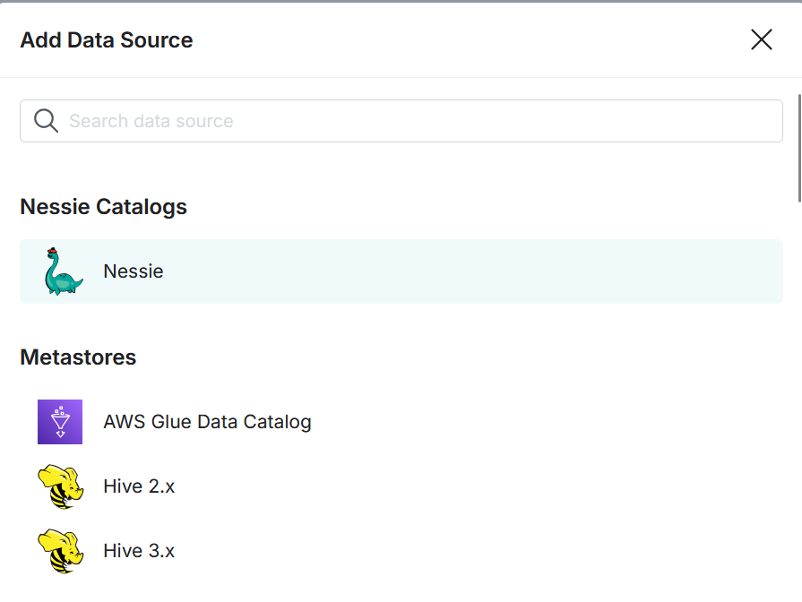
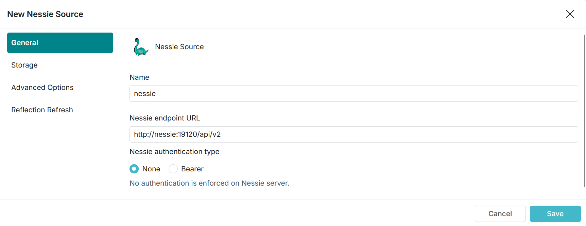
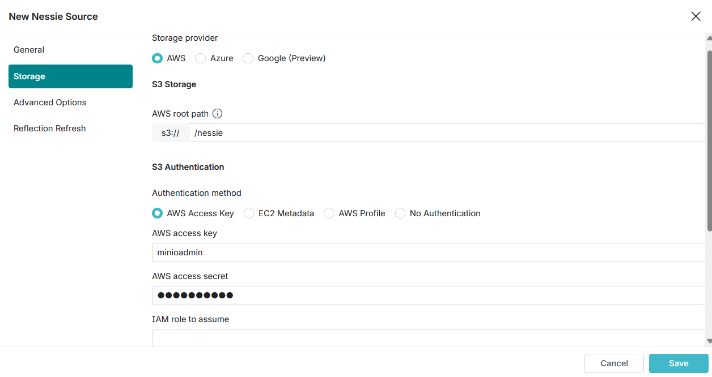
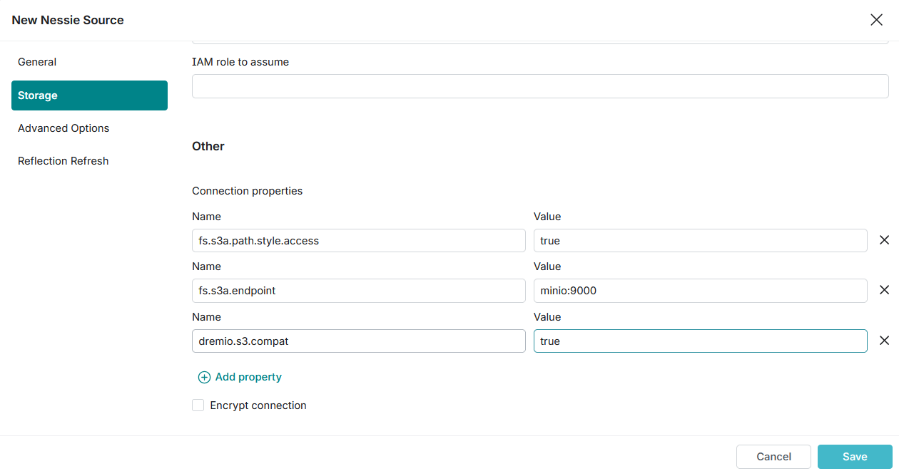
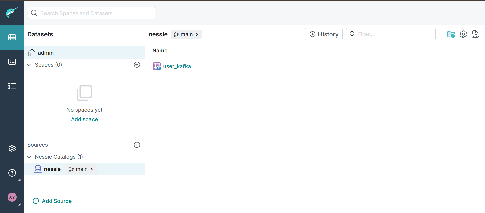

# Datalakehouse

In questa repo sono presenti due docker compose:

- `docker-compose-basic.yml` si occupa di eseguire i servizi essenziali, ossia Dremio, MinIO e Project Nessie. Inoltre è presente Jupyter per l'esplorazione dei dati. Con questi servizi l'utente è libero di scrivere dati a piacere in formato Iceberg e di utilizzare i Sample Source di Dremio per alcuni test;
- `docker-compose-streaming.yml` oltre ai servizi citati prima, si occupa di eseguire anche Kafka con il Kafka Connect Sink Iceberg già installato.

## Esecuzione dell'ambiente

Effettuare il clone della repo e spostarsi all'interno di essa:

```bash
git clone https://github.com/lorepas/datalakehouse.git && cd datalakehouse
```

Per eseguire il docker compose base basterà eseguire:

```bash
docker compose -f docker-compose-basic.yml up
```

Se invece vogliamo eseguire il docker compose che contiene anche i servizi Streaming occorrerà eseguire:

```bash
docker compose -f docker-compose-streaming.yml up
```

## Jupyter

Il servizio è esposto su `http://localhost:8888` ed il token da inserire è `notebook`.

## MinIO

MinIO nascerà con il bucket `nessie` già creato. Esporrà i seguenti servizi:

- Web UI: `http://localhost:9001`
- API: `http://localhost:9000`

Le credenziali saranno:

- Username: `minioadmin`
- Password: `minioadmin`

Da Web UI vi è la possibilità di creare bucket a piacere.

## Dremio

Dremio sarà raggiungibile al seguente indirizzo: `http://localhost:9047`. Al primo accesso è necessario registrarsi. Vi è la possibilità di utilizzare la sorgente **Sample Source**, nella quale sono presenti alcuni dati di esempio. Inoltre, vi è la possibilità di promuovere una sorgente Nessie.

### Connessione Source Nessie

Per connettere la sorgente Project Nessie a Dremio è sufficiente seguire questi step:

1. Andare in Add Source e selezionare la sorgente Nessie:



1. Inserire i seguenti parametri:

    - Name: `nessie`
    - Endpoint URL: `http://nessie:19120/api/v2`
    - Authentication: `none`



1. In **Storage** inserire i seguenti parametri:
  
    - Storage Provider: `AWS`
    - Root path: `/nessie`
    - Authentication Method: `AWS Access Key`
      - AWS Access Key: `minioadmin`
      - AWS Access Secret: `minioadmin`



1. Nella stessa pagina, in **Other** inserire delle proprietà aggiuntive:

    - Name: `fs.s3a.path.style.access` e Value: `true`
    - Name: `fs.s3a.endpoint` e Value: `minio:9000`
    - Name: `dremio.s3.compat` e Value: `true`
    - Disattiva `Encrypt Connection`



1. Clicca su Salva

## Project Nessie

Il servizio di Project Nessie espone una UI al seguente indirizzo: `http://localhost:19120`.

## Kafka UI

Il servizio di Kafka UI è visibile alla URL: `http://localhost:8080`.

## Kafka Connect

Il Kafka Connect viene inizializzato automaticamente per stare in ascolto sul topic `user` e creerà una tabella Iceberg visibile su Dremio con il nome `user_kafka`. Per cambiare eventuali parametri sarà sufficiente entrare nel container del Kafka Connect con il comando: `docker exec -it datalakehouse-kafka-connect-1 /bin/bash` ed effettuare le modifiche opportune.

## Kafka

Vi è la possibilità di produrre alcuni dati di esempio direttamente sul topic `user` nel quale sarà in ascolto il Kafka Connect. Per farlo occorre:

- Entrare nel container: `docker exec -it kafka /bin/bash`
- Eseguire il CLI producer che prende in input i dati di esempio: `kafka-console-producer --bootstrap-server localhost:9092 --topic user < /kafka-example-data/records.txt`
- I dati saranno visibili su Dremio:


